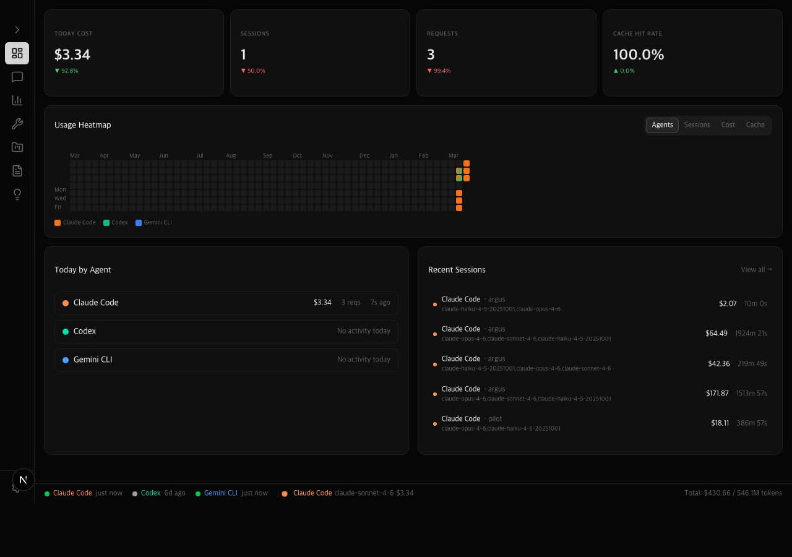

# Argus

**Unified monitoring dashboard for AI coding agents — track costs, tokens, and sessions across Claude Code, Codex CLI, and Gemini CLI.**

[](LICENSE)
[](https://nextjs.org/)
[](https://www.typescriptlang.org/)
[](https://sqlite.org/)
[](https://www.electronjs.org/)

## Features

- **Multi-Agent Unified View** — Monitor Claude Code, Codex CLI, and Gemini CLI from a single dashboard
- **No Auth, Local Only** — Your data stays on your machine. No accounts, no cloud, no tracking
- **OTLP Telemetry Ingestion** — Receives OpenTelemetry data directly from AI agents
- **Real-Time Dashboard** — Visualize costs, token usage, sessions, and tool analytics
- **Project-Level Analysis** — Break down usage by project with cost insights and AI-powered suggestions
- **Electron Desktop App** — Tray-resident app for Mac and Windows with background OTLP ingestion
- **Docker Compose One-Click** — Single command deployment *(coming soon)*

## Screenshots



> Screenshots will be added soon. Run `pnpm dev` to see the dashboard in action.

## Quick Start

```bash
git clone https://github.com/79841/argus.git
cd argus/dashboard
pnpm install
pnpm dev
# Open http://localhost:3000
```

To seed test data for development:

```bash
curl -X POST http://localhost:3000/api/seed
```

## Agent Setup

Configure your AI coding agents to send telemetry to Argus.

### Claude Code

```bash
export CLAUDE_CODE_ENABLE_TELEMETRY=1
export OTEL_LOGS_EXPORTER=otlp
export OTEL_EXPORTER_OTLP_PROTOCOL=http/json
export OTEL_EXPORTER_OTLP_ENDPOINT=http://localhost:3000
```

### Codex CLI

```bash
export CODEX_OTEL_EXPORT_ENABLED=true
export OTEL_EXPORTER_OTLP_ENDPOINT=http://localhost:3000
export OTEL_EXPORTER_OTLP_PROTOCOL=http/json
```

### Gemini CLI

```bash
export GEMINI_CLI_OTEL_ENABLED=true
export OTEL_EXPORTER_OTLP_ENDPOINT=http://localhost:3000
export OTEL_EXPORTER_OTLP_PROTOCOL=http/json
```

> For detailed setup instructions, see the [Setup Guide](docs/setup-guide.md).

## Tech Stack

| Layer | Technology |
|-------|------------|
| Collection | Next.js API Route (`/v1/logs`, OTLP JSON) |
| Storage | SQLite (`better-sqlite3`, WAL mode) |
| Dashboard | Next.js 15+, TypeScript, Tailwind CSS, shadcn/ui, Recharts |
| Desktop | Electron (tray icon, background OTLP receiver) |
| Package Manager | pnpm |

## Architecture

```
Codex CLI / Claude Code / Gemini CLI
        │ OTLP HTTP (POST /v1/logs)
        ▼
    Next.js API Route (agent_type tagging)
        │
        ▼
    SQLite (agent_logs + pricing_model + config_snapshots)
        │
        ▼
    Dashboard (Next.js, no auth, local only)
```

## Documentation

- [Setup Guide](docs/setup-guide.md) — Detailed installation and agent configuration
- [User Guide](docs/user-guide.md) — Dashboard features and usage
- [API Reference](docs/api-reference.md) — Ingest endpoints and query APIs
- [Architecture](docs/architecture.md) — System design and data flow

## Contributing

Contributions are welcome!

1. Fork the repository
2. Create a feature branch (`git checkout -b feature/my-feature`)
3. Commit your changes (`git commit -m 'feat: add my feature'`)
4. Push to the branch (`git push origin feature/my-feature`)
5. Open a Pull Request against `develop`

## License

[MIT](LICENSE)
