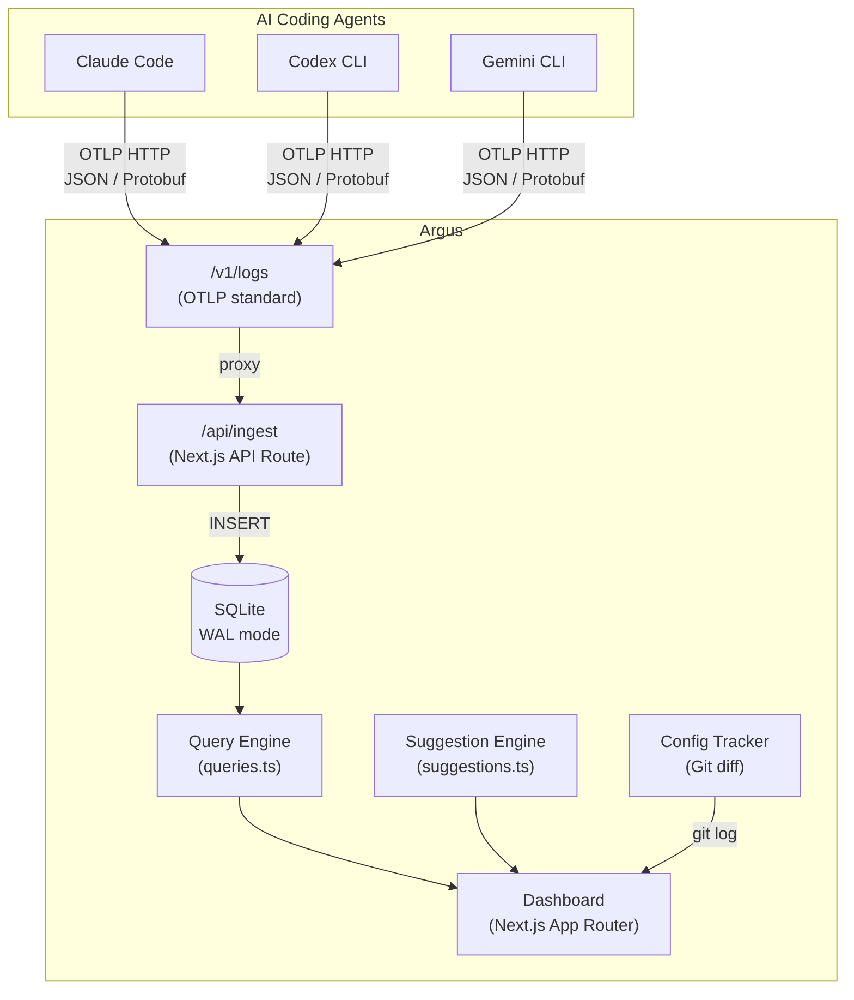
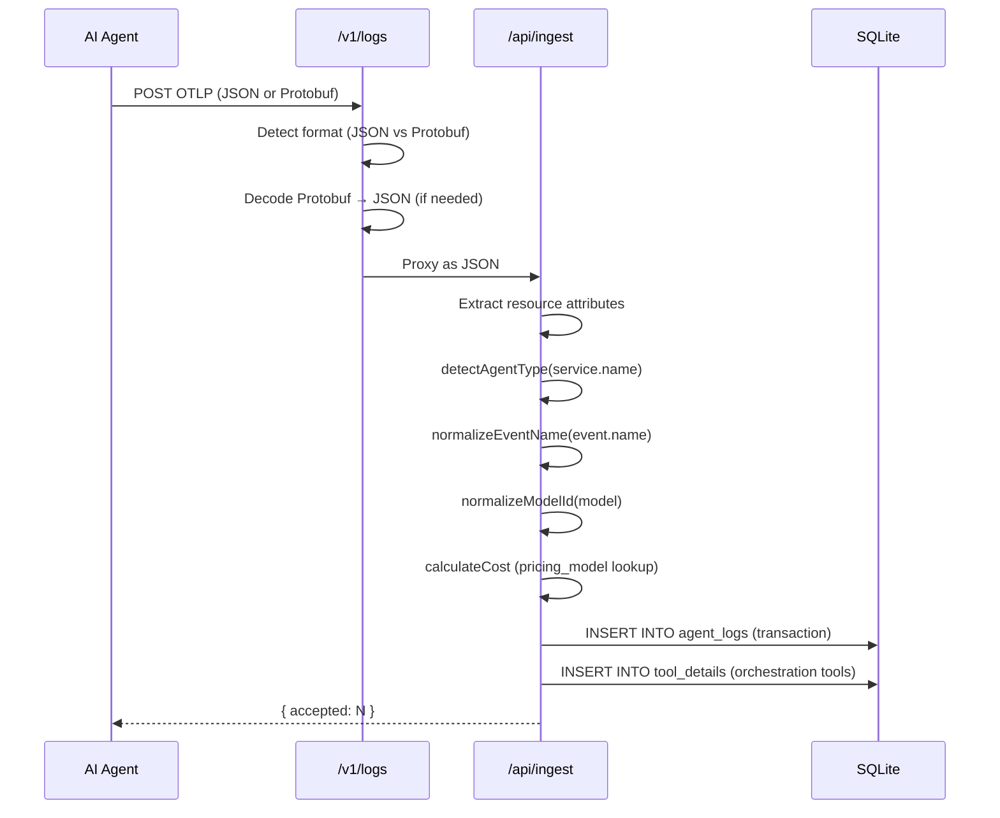
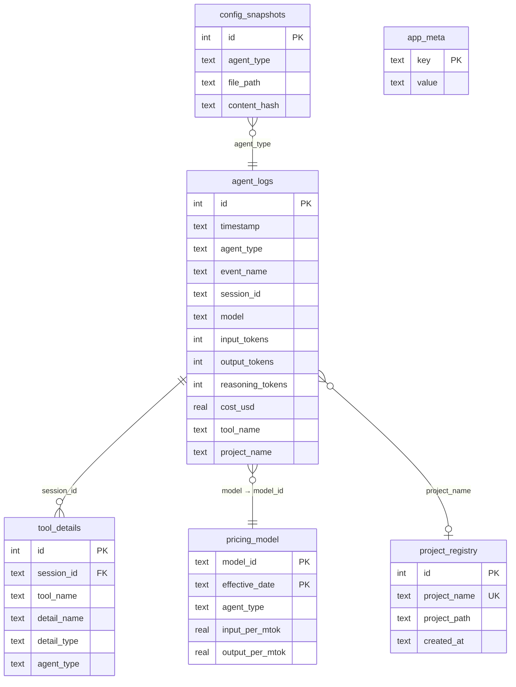
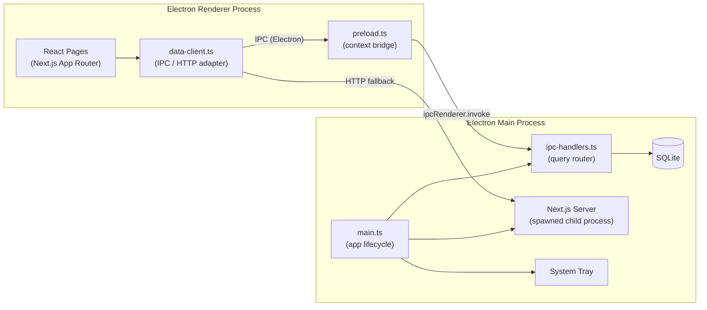
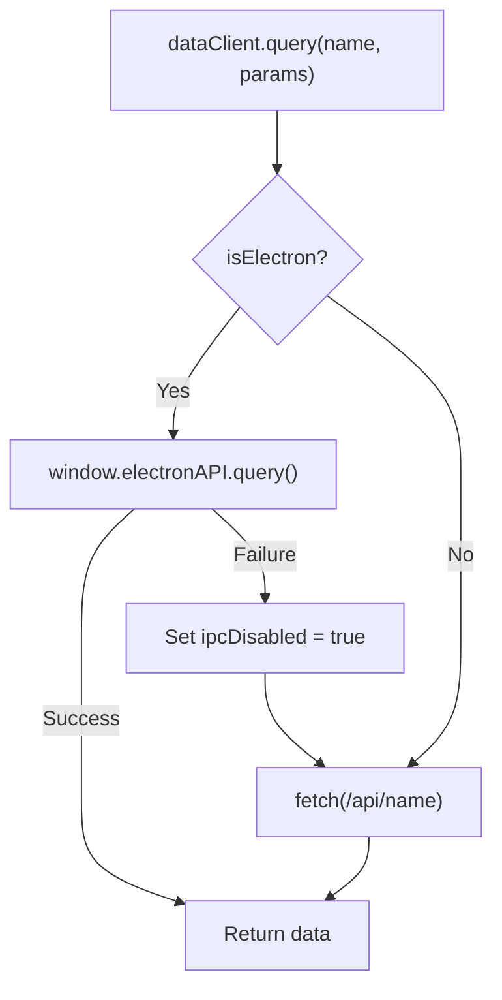

Argus is a local-only, zero-auth monitoring tool that collects OpenTelemetry data from AI coding agents (Claude Code, Codex CLI, Gemini CLI) and visualizes usage metrics through a unified dashboard.

## 1. System Overview



### Key Design Decisions

- **No authentication** -- designed for personal, local-only use.
- **No external collector** -- Next.js API routes receive OTLP directly, eliminating the need for an OTel Collector.
- **SQLite with WAL mode** -- single-file storage with concurrent read support; auto-initialized on first startup.
- **Multi-agent normalization** -- each agent's telemetry schema is normalized into a unified `agent_logs` table at ingest time.

## 2. Data Collection Flow

### Ingestion Pipeline



### OTLP Endpoints

| Endpoint | Format | Purpose |
|----------|--------|---------|
| `POST /v1/logs` | JSON + Protobuf | OTLP standard path. Agents send here by default. |
| `POST /v1/metrics` | JSON + Protobuf | Processes Gemini CLI tool/session metrics and Claude Code productivity metrics. |
| `POST /v1/traces` | - | Accepted but ignored (returns 200). |
| `POST /api/ingest` | JSON only | Internal processing route. `/v1/logs` proxies here. |

### Agent Type Detection

The `service.name` resource attribute determines the agent type:

| service.name contains | agent_type |
|----------------------|------------|
| `codex` | `codex` |
| `claude` | `claude` |
| `gemini` | `gemini` |
| (default) | `claude` |

### Event Normalization

Each agent uses different event name prefixes. These are normalized at ingest:

| Agent | Raw Event | Normalized |
|-------|-----------|------------|
| Claude Code | `claude_code.api_request` | `api_request` |
| Claude Code | `claude_code.tool_result` | `tool_result` |
| Codex CLI | `codex.sse_event` (kind=response.completed) | `api_request` |
| Codex CLI | `codex.conversation_starts` | `session_start` |
| Gemini CLI | `gemini_cli.api_response` | `api_request` |
| Gemini CLI | `gemini_cli.tool_call` | `tool_result` |

### Recognized Event Types

| Event | Description |
|-------|-------------|
| `api_request` | LLM API call with tokens, cost, model, duration |
| `user_prompt` | User input event |
| `tool_result` | Tool execution result with success/failure |
| `tool_decision` | Tool approval/rejection |
| `session_start` | Session initialization |
| `api_error` | API error with status code |

### Cost Calculation

1. Claude Code sends `cost_usd` directly in telemetry -- used as-is.
2. For Codex and Gemini, cost is computed from the `pricing_model` table:

```
cost = (input_tokens * input_per_mtok
      + output_tokens * output_per_mtok
      + cache_read_tokens * cache_read_per_mtok
      + reasoning_tokens * output_per_mtok) / 1,000,000
```

### Tool Detail Extraction

Orchestration tools (Agent, Skill, MCP) are automatically extracted from `tool_result` events and stored in the `tool_details` table:

| Tool Pattern | detail_type | Detection |
|-------------|-------------|-----------|
| `mcp__*` or `mcp_tool` | `mcp` | Tool name prefix or `mcp_server_name` param |
| `Skill` | `skill` | `skill_name` param from tool_parameters |
| `Agent` | `agent` | `subagent_type` or `name` param |

### Project Name Extraction

- **Claude Code / Gemini CLI**: `project.name` from OTEL resource attributes.
- **Codex CLI**: Extracted from `arguments.workdir` in tool parameters; backfilled across all events in the same session.

## 3. SQLite Schema

Schema is auto-initialized in `src/shared/lib/db.ts` on application startup. The `schema_version` table tracks migrations, and version-based migrations run automatically when new columns or tables are added.

### agent_logs

Primary table storing all telemetry events.

| Column | Type | Default | Description |
|--------|------|---------|-------------|
| `id` | INTEGER | AUTO | Primary key |
| `timestamp` | TEXT | now() | ISO 8601 timestamp |
| `agent_type` | TEXT | `'claude'` | Agent identifier: `claude`, `codex`, `gemini` |
| `service_name` | TEXT | `'claude-code'` | Original `service.name` from OTLP |
| `event_name` | TEXT | `''` | Normalized event type |
| `session_id` | TEXT | `''` | Session identifier |
| `prompt_id` | TEXT | `''` | Prompt correlation ID |
| `model` | TEXT | `''` | Model identifier (e.g. `claude-sonnet-4-20250514`) |
| `input_tokens` | INTEGER | `0` | Input token count |
| `output_tokens` | INTEGER | `0` | Output token count |
| `cache_read_tokens` | INTEGER | `0` | Cache read tokens |
| `cache_creation_tokens` | INTEGER | `0` | Cache creation tokens |
| `reasoning_tokens` | INTEGER | `0` | Reasoning/thinking tokens |
| `cost_usd` | REAL | `0.0` | Cost in USD |
| `duration_ms` | INTEGER | `0` | Response duration in milliseconds |
| `speed` | TEXT | `'normal'` | Speed tier |
| `tool_name` | TEXT | `''` | Tool name (for tool events) |
| `tool_success` | INTEGER | NULL | Tool success: 1=true, 0=false, NULL=unknown |
| `severity_text` | TEXT | `'INFO'` | Log severity |
| `body` | TEXT | `''` | Log body / error message |
| `project_name` | TEXT | `''` | Project name |
| `resource_attributes` | TEXT | `'{}'` | JSON of OTLP resource attributes |
| `log_attributes` | TEXT | `'{}'` | JSON of OTLP log attributes |

**Indexes**: `timestamp`, `agent_type`, `session_id`, `event_name`, `date(timestamp)`, `prompt_id`, `project_name`

### pricing_model

Per-model token pricing. Auto-seeded with known models on startup.

| Column | Type | Description |
|--------|------|-------------|
| `model_id` | TEXT | Model identifier (PK with effective_date) |
| `agent_type` | TEXT | Agent type |
| `effective_date` | TEXT | Date pricing takes effect |
| `input_per_mtok` | REAL | Input cost per million tokens |
| `output_per_mtok` | REAL | Output cost per million tokens |
| `cache_read_per_mtok` | REAL | Cache read cost per million tokens |
| `cache_creation_per_mtok` | REAL | Cache creation cost per million tokens |

**Primary Key**: `(model_id, effective_date)`

### config_snapshots

Historical snapshots of agent configuration files.

| Column | Type | Description |
|--------|------|-------------|
| `id` | INTEGER | Primary key |
| `timestamp` | TEXT | ISO 8601 timestamp |
| `agent_type` | TEXT | Agent type |
| `file_path` | TEXT | Config file path |
| `content` | TEXT | File content |
| `content_hash` | TEXT | Content hash for dedup |

**Index**: `(agent_type, file_path, timestamp)`

### tool_details

Detailed tracking of orchestration tool invocations (MCP servers, Skills, Sub-agents).

| Column | Type | Description |
|--------|------|-------------|
| `id` | INTEGER | Primary key |
| `timestamp` | TEXT | ISO 8601 timestamp |
| `session_id` | TEXT | Session identifier |
| `tool_name` | TEXT | Parent tool (e.g. `mcp:linear-server`, `Skill`, `Agent`) |
| `detail_name` | TEXT | Specific invocation name |
| `detail_type` | TEXT | Category: `agent`, `skill`, `mcp` |
| `duration_ms` | INTEGER | Execution duration |
| `success` | INTEGER | Success flag (1/0/NULL) |
| `project_name` | TEXT | Project name |
| `metadata` | TEXT | JSON metadata |
| `agent_type` | TEXT | Agent type |

**Indexes**: `timestamp`, `(tool_name, detail_name)`, `session_id`

### project_registry

Connected project path management.

| Column | Type | Description |
|--------|------|-------------|
| `id` | INTEGER | Primary key |
| `project_name` | TEXT | Project name (unique) |
| `project_path` | TEXT | Absolute filesystem path |
| `created_at` | TEXT | ISO 8601 timestamp |

### app_meta

App-level metadata (key-value store).

| Column | Type | Description |
|--------|------|-------------|
| `key` | TEXT | Primary key |
| `value` | TEXT | Metadata value |

### Entity Relationship



## 4. Electron Architecture

Argus runs as both a web application (`pnpm dev`) and a desktop application (`pnpm electron:dev`).



### Lifecycle

1. `app.whenReady()` triggers startup.
2. `registerIpcHandlers()` registers `db:query` and `db:mutate` IPC channels.
3. System tray icon is created (`createTray()`).
4. Next.js dev server is spawned as a child process on port 9845.
5. Once `/api/health` responds, the main `BrowserWindow` is created.
6. Window close hides to tray (macOS); quit terminates the Next.js process.

### IPC Channels

| Channel | Direction | Purpose |
|---------|-----------|---------|
| `db:query` | Renderer -> Main | Read queries (overview, sessions, daily, etc.) |
| `db:mutate` | Renderer -> Main | Write operations (settings, pricing sync, config) |
| `capture-screenshot` | Renderer -> Main | Capture window screenshot |

### IPC Query Router

The `ipc-handlers.ts` maps query names to the same functions used by API routes:

| Query Name | Handler |
|-----------|---------|
| `overview` | `getOverviewStats` + `getAllTimeStats` + `getOverviewDelta` |
| `daily` | `getDailyStats` |
| `sessions` | `getSessions` |
| `sessions/{id}` | `getSessionDetail` |
| `sessions/active` | `getActiveSessions` |
| `models` | `getModelUsage` |
| `efficiency` | `getEfficiencyStats` + `getEfficiencyComparison` |
| `tools` | `getToolUsageStats` / `getToolDetailStats` |
| `projects` | `getProjects` / `getProjectCosts` / `getProjectComparison` |
| `insights` | `getHighCostSessions` + `getModelCostEfficiency` + `getBudgetStatus` |
| `suggestions` | `getSuggestionMetrics` + `generateSuggestions` |
| `config-history` | `getConfigHistory` (Git-based) |

## 5. Data Client Abstraction

`data-client.ts` provides a unified data access layer that works in both web and Electron environments.



### Behavior

- **Detection**: `isElectron()` checks for `window.electronAPI` exposed by the preload script.
- **IPC-first**: In Electron, queries go through IPC for direct SQLite access (no HTTP overhead).
- **Auto-fallback**: If IPC fails once, `ipcDisabled` is set to `true` and all subsequent calls use HTTP.
- **Identical interface**: `query(name, params)` for reads, `mutate(name, body)` for writes.

### Preload Bridge

`preload.ts` uses `contextBridge.exposeInMainWorld` to safely expose three methods:

```
window.electronAPI = {
  query(name, params)          → ipcRenderer.invoke('db:query', ...)
  mutate(name, body)           → ipcRenderer.invoke('db:mutate', ...)
  captureScreenshot(savePath)  → ipcRenderer.invoke('capture-screenshot', ...)
}
```

## 6. Directory Structure

```
argus/
├── dashboard/                         # Next.js + Electron application
│   ├── src/
│   │   ├── app/                       # App Router — routing only
│   │   │   ├── api/                   # API routes (30 endpoints)
│   │   │   ├── (dashboard)/           # Route group (shared layout)
│   │   │   │   ├── page.tsx           # Overview
│   │   │   │   ├── sessions/          # Session list + [id] detail
│   │   │   │   ├── usage/             # Usage analytics (M3)
│   │   │   │   ├── tools/             # Tool tracking
│   │   │   │   ├── user/              # User config file viewer
│   │   │   │   ├── projects/          # Project list + [name] detail (sub-tabs: overview, sessions, usage, tools, rules)
│   │   │   │   └── settings/          # Settings
│   │   │   ├── onboarding/            # Onboarding flow
│   │   │   └── v1/                    # OTLP standard endpoints
│   │   ├── features/                  # Feature modules (domain components/logic/tests)
│   │   │   └── {feature-name}/        # components/, lib/, hooks/, __tests__/, index.ts
│   │   └── shared/                    # Shared modules (used by 2+ features)
│   │       ├── components/            # Shared components (ui/, filters, nav)
│   │       ├── hooks/                 # Shared hooks
│   │       └── lib/                   # Utilities (db, queries, format, agents)
│   │           ├── db.ts              # SQLite client + schema + migrations
│   │           ├── queries/           # SQL query modules (11 files)
│   │           ├── ingest-utils.ts    # OTLP parsing & normalization
│   │           ├── data-client.ts     # IPC/HTTP abstraction layer
│   │           ├── suggestions.ts     # Rule-based suggestion engine
│   │           ├── config-tracker.ts  # Git-based config change tracking
│   │           ├── agents.ts          # Agent definitions (colors, icons)
│   │           ├── pricing-sync.ts    # LiteLLM pricing sync
│   │           ├── registered-tools.ts# MCP/agent/skill tool scanner
│   │           └── i18n.ts            # Internationalization (ko/en)
│   └── electron/                      # Electron desktop app
│       ├── main.ts                    # Entry point (window, tray, IPC)
│       ├── preload.ts                 # IPC bridge
│       ├── presentation/              # window.ts, tray.ts
│       ├── infrastructure/            # Next.js server, IPC handlers
│       └── domain/                    # config, mutation, query services
├── website/                           # Documentation site (separate Next.js)
├── docs/                              # User documentation
├── scripts/                           # Utility scripts
└── .claude/                           # Claude Code configuration
    ├── agents/                        # Agent definitions
    └── skills/                        # Skill definitions
```

## 7. Technology Stack

| Layer | Technology | Version | Purpose |
|-------|-----------|---------|---------|
| **Runtime** | Node.js | 20+ | Server runtime |
| **Framework** | Next.js | 16.1 | App Router, API routes, SSR |
| **Language** | TypeScript | 5.x | Strict mode |
| **UI Library** | React | 19.x | Component rendering |
| **Styling** | Tailwind CSS | 4.x | Utility-first CSS |
| **Components** | shadcn/ui | 4.x | Accessible UI primitives |
| **Charts** | Recharts | 3.x | Data visualization |
| **Database** | SQLite | - | Local storage (WAL mode) |
| **DB Driver** | better-sqlite3 | 12.x | Synchronous SQLite API |
| **Desktop** | Electron | 40.x | Desktop wrapper with tray |
| **Build** | electron-builder | 26.x | DMG (macOS) / NSIS (Windows) |
| **Testing** | Vitest | 4.x | Unit & integration tests |
| **Package Manager** | pnpm | - | Fast, disk-efficient |
| **Telemetry** | OpenTelemetry | - | OTLP protocol parsing |

## 8. Configuration Tracking

The config tracker (`config-tracker.ts`) monitors agent configuration file changes via Git history.

### Tracked Files

| Agent | Files |
|-------|-------|
| Claude Code | `CLAUDE.md`, `.claude/settings.json`, `.claude/agents/*.md`, `.claude/skills/*/SKILL.md`, `.mcp.json` |
| Codex CLI | `codex.md`, `AGENTS.md`, `~/.codex/config.toml`, `~/.codex/instructions.md` |
| Gemini CLI | `GEMINI.md`, `~/.gemini/settings.json` |

### How It Works

1. Runs `git log --since=N --follow -- <file>` for each tracked file.
2. For each commit, runs `git diff <hash>~1..<hash>` to extract the diff.
3. Returns changes sorted by date (newest first).
4. Diffs are truncated to 2000 characters for storage efficiency.

## 9. Suggestion Engine

The suggestion engine (`suggestions.ts`) analyzes usage metrics and generates actionable recommendations.

### Rules

| Rule ID | Trigger | Severity |
|---------|---------|----------|
| `low_cache_rate` | Cache hit rate < 50% | Warning (< 20%: Critical) |
| `high_tool_fail_rate` | Tool failure rate > 15% | Warning (> 30%: Critical) |
| `high_expensive_model_ratio` | Expensive model usage > 70% | Warning (> 90%: Critical) |
| `high_avg_session_cost` | Avg session cost > $2 | Warning (> $5: Critical) |
| `high_daily_cost` | Daily cost > $10 | Warning (> $20: Critical) |
| `tool_fail_{name}` | Individual tool fail rate > 30% | Warning (> 50%: Critical) |

### Categories

- **cost** -- spending optimization
- **cache** -- cache utilization
- **tools** -- tool reliability
- **performance** -- overall efficiency
