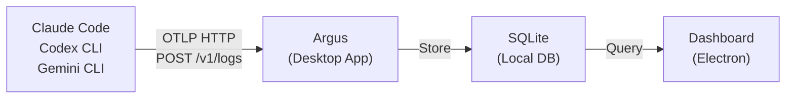

Argus is a local monitoring dashboard for AI coding agents. It receives OpenTelemetry (OTLP) telemetry from Claude Code, Codex CLI, and Gemini CLI, and visualizes usage in a unified dashboard.

## How It Works

1. **AI agents** emit telemetry events (API requests, tool usage, costs) via OTLP
2. **Argus** receives and stores them in a local SQLite database
3. **Dashboard** visualizes costs, tokens, sessions, tools, and more

## Next Steps

1. [Install Argus](/docs/en/installation) — Download the desktop app
2. [Configure your agents](/docs/en/setup-guide) — Set up telemetry for Claude Code, Codex, or Gemini
3. [Explore the dashboard](/docs/en/user-guide) — Learn about each page
